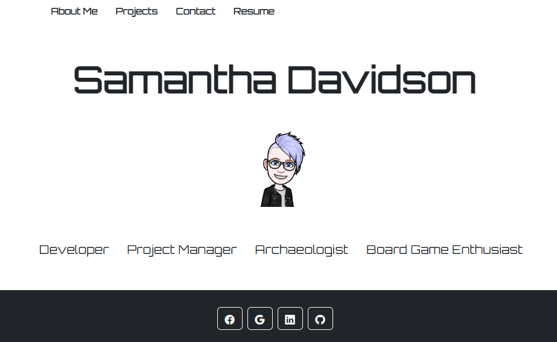

# React Portfolio 

## Description 

The goal of this project was to was to create a professional portfolio website. This site contains information about me, including a brief description of my interests, contact information, and links to projects that I have worked on. Technologies used were React, JavaScript, HTML, and CSS. 

## Site Image

To visit the site, please click [here](https://samanthajanedavidson.github.io/portfolio-react/).

## License

Please refer to the license in the repo. 
